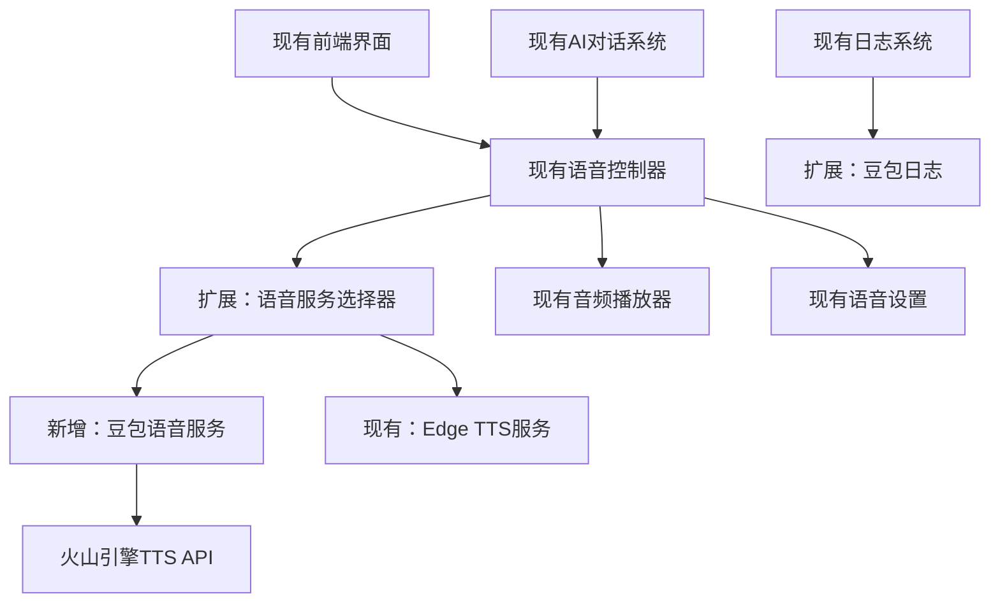

# Design Document: 豆包语音集成

## Overview

本设计文档描述了将豆包（Doubao）语音服务集成到现有AI对话系统中的技术方案。豆包语音服务基于火山引擎的TTS API，提供高质量的中文语音合成能力。该集成将作为现有Edge TTS服务的补充选项，保持现有系统架构和功能不变，仅添加豆包语音作为新的语音合成选项。

## Architecture

### 系统架构图



### 集成策略

- **最小侵入性**：在现有 `EdgeTTSService` 基础上添加 `DoubaoTTSService`
- **保持兼容性**：现有接口和功能完全不变
- **可选启用**：豆包服务作为可选功能，可通过配置启用/禁用
- **降级支持**：豆包服务不可用时自动降级到Edge TTS

## Components and Interfaces

### 1. DoubaoTTSService 类（新增）

```python
class DoubaoTTSService:
    def __init__(self, app_key: str, token: str):
        """初始化豆包语音服务"""
        
    async def synthesize_speech_async(self, text: str, persona: str, style: str) -> bytes:
        """异步语音合成，保持与EdgeTTSService相同的接口"""
        
    def synthesize_speech(self, text: str, persona: str, style: str) -> bytes:
        """同步语音合成，保持与EdgeTTSService相同的接口"""
        
    def get_voice_config(self, persona: str, style: str) -> dict:
        """获取语音配置，保持与EdgeTTSService相同的接口"""
        
    def create_request_payload(self, text: str, persona: str, style: str) -> dict:
        """创建豆包API请求载荷"""
```

### 2. 现有EnhancedServerHandler扩展

```python
# 在现有的do_POST方法中添加新的API端点
def do_POST(self):
    # ... 现有代码保持不变 ...
    
    elif parsed.path == "/api/doubao-synthesize":
        # 新增豆包语音合成接口
        self.handle_doubao_synthesis(data)
    
    elif parsed.path == "/api/voice-service-switch":
        # 新增语音服务切换接口
        self.handle_service_switch(data)
```

### 3. 配置扩展

```python
# 在现有配置基础上添加豆包配置
DOUBAO_CONFIG = {
    "app_key": os.getenv("DOUBAO_APP_KEY", ""),
    "token": os.getenv("DOUBAO_TOKEN", ""),
    "api_url": "https://sami.bytedance.com/api/v1/invoke",
    "enabled": False  # 默认禁用，需要手动启用
}
```

### 4. API接口定义

#### 豆包语音合成接口（新增）
```
POST /api/doubao-synthesize
Content-Type: application/json

{
    "text": "要合成的文本",
    "persona": "tourist",
    "style": "personified"
}

Response:
{
    "success": true,
    "audio_url": "/audio/doubao_tourist_personified_abc123.mp3",
    "method": "doubao_tts",
    "service_used": "doubao"
}
```

#### 语音服务状态接口（扩展现有）
```
GET /api/speech-status

Response:
{
    "edge_tts_available": true,
    "doubao_available": true,
    "current_service": "edge_tts",
    "available_services": ["edge_tts", "doubao", "browser"],
    "fallback_to_browser": false,
    "message": "多语音服务可用"
}
```

## Data Models

### 豆包API请求模型

```python
@dataclass
class DoubaoRequest:
    text: str
    speaker: str = "zh_female_qingxin"
    audio_config: dict = field(default_factory=lambda: {
        "format": "mp3",
        "sample_rate": 24000,
        "speech_rate": 0,
        "pitch_rate": 0
    })

@dataclass
class DoubaoResponse:
    success: bool
    audio_data: Optional[bytes]
    error_message: Optional[str]
    task_id: str
    duration: Optional[float]
```

### 服务配置模型

```python
@dataclass
class DoubaoConfig:
    app_key: str
    token: str
    api_url: str = "https://sami.bytedance.com/api/v1/invoke"
    timeout: int = 30
    max_retries: int = 3
    enabled: bool = False
```

## Correctness Properties

*A property is a characteristic or behavior that should hold true across all valid executions of a system-essentially, a formal statement about what the system should do. Properties serve as the bridge between human-readable specifications and machine-verifiable correctness guarantees.*

### Property 1: 语音合成触发正确性
*For any* 用户点击语音播放按钮的操作，系统应该正确调用豆包语音服务并返回有效的语音数据
**Validates: Requirements 1.1**

### Property 2: 语音播放自动启动
*For any* 语音合成成功完成的情况，音频播放器应该自动开始播放生成的语音文件
**Validates: Requirements 1.2**

### Property 3: 播放状态显示一致性
*For any* 语音播放过程中的时刻，前端界面显示的播放状态和进度应该与实际播放状态保持一致
**Validates: Requirements 1.3**

### Property 4: 停止操作即时性
*For any* 用户点击停止按钮的操作，音频播放器应该立即停止播放并将状态重置为初始状态
**Validates: Requirements 1.4**

### Property 5: 错误处理完整性
*For any* 豆包API调用失败的情况，语音合成引擎应该返回包含错误类型和描述的明确错误信息，并在日志中记录完整的错误详情
**Validates: Requirements 2.1**

### Property 6: 重试机制限制性
*For any* 网络连接不稳定导致的API调用失败，语音合成引擎的重试次数应该严格限制在3次以内
**Validates: Requirements 2.2**

### Property 7: 超时机制准确性
*For any* 语音合成请求，如果在30秒内没有收到响应，系统应该触发超时并返回超时错误状态
**Validates: Requirements 2.3**

### Property 8: 认证错误识别性
*For any* 使用无效API密钥的请求，语音合成引擎应该识别认证错误并提供配置检查的用户友好提示
**Validates: Requirements 2.4**

### Property 9: 语音参数应用正确性
*For any* 用户选择的语音参数组合（发音人、语速、音调等），语音合成引擎应该在生成语音时正确应用这些参数
**Validates: Requirements 3.2**

### Property 10: 设置持久化一致性
*For any* 用户保存的语音设置，系统应该将完整的设置数据持久化到本地存储，并在下次启动时正确加载
**Validates: Requirements 3.3, 3.4**

### Property 11: 接口兼容性保持
*For any* 现有的语音接口调用，集成豆包服务后的系统应该保持相同的接口签名和行为
**Validates: Requirements 4.1**

### Property 12: 服务切换无缝性
*For any* 语音服务之间的切换操作，系统应该能够在豆包和Edge TTS之间无缝切换而不影响正在进行的操作
**Validates: Requirements 4.2**

### Property 13: 日志记录完整性
*For any* 语音合成请求，系统应该记录包含请求时间、文本长度、响应时间和使用的服务等完整信息的日志条目
**Validates: Requirements 5.1**

### Property 14: 错误日志详细性
*For any* 语音服务错误，系统应该记录包含错误类型、详细错误消息、发生时间和上下文信息的完整错误日志
**Validates: Requirements 5.2**

## Error Handling

### 错误分类和处理策略

#### 1. API调用错误
- **认证错误 (401)**：提示用户检查API密钥配置
- **请求限制 (429)**：实现指数退避重试
- **服务不可用 (503)**：自动切换到备用服务
- **请求格式错误 (400)**：记录详细错误并提供修复建议

#### 2. 网络错误
- **连接超时**：重试机制，最多3次
- **DNS解析失败**：检查网络连接，提供诊断信息
- **SSL证书错误**：记录证书问题，提供安全警告

#### 3. 音频处理错误
- **音频格式不支持**：自动转换或提示用户
- **音频文件损坏**：重新生成音频
- **播放器错误**：降级到浏览器原生播放器

#### 4. 降级策略
```python
FALLBACK_CHAIN = [
    "doubao",      # 首选：豆包语音服务（如果启用）
    "edge_tts",    # 现有：Edge TTS（保持不变）
    "browser"      # 最后：浏览器语音合成（保持不变）
]
```

## Testing Strategy

### 双重测试方法

本项目采用**单元测试**和**属性测试**相结合的综合测试策略：

- **单元测试**：验证具体示例、边界情况和错误条件
- **属性测试**：验证通用属性在所有输入下的正确性
- **集成测试**：验证组件间的协作和端到端流程

### 属性测试配置

- **测试框架**：使用 `hypothesis` 进行属性测试
- **测试迭代**：每个属性测试最少运行100次迭代
- **测试标记**：每个属性测试使用注释标记对应的设计属性

示例标记格式：
```python
# Feature: doubao-voice-integration, Property 1: 语音合成触发正确性
def test_voice_synthesis_trigger_correctness():
    pass
```

### 测试重点领域

#### 1. API集成测试
- 豆包API调用的正确性
- 错误响应的处理
- 重试机制的验证
- 超时处理的准确性

#### 2. 服务切换测试
- 多服务间的无缝切换
- 降级机制的可靠性
- 配置更新的即时生效

#### 3. 音频处理测试
- 不同格式音频的处理
- 音频质量的验证
- 播放控制的准确性

#### 4. 性能测试
- 并发请求的处理能力
- 内存使用的优化
- 响应时间的监控

### 测试数据生成

使用智能生成器创建测试数据：
- **文本生成器**：生成各种长度和复杂度的中文文本
- **配置生成器**：生成有效和无效的API配置组合
- **参数生成器**：生成语音参数的边界值和随机组合